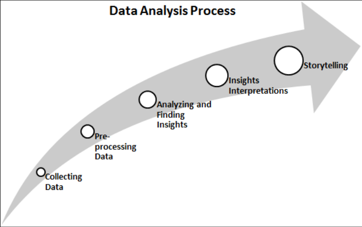

# Python 库入门

## 数据分析的标准流程

数据分析是指调查数据，从中发现有意义的见解并得出结论。此过程的主要目标是收集、过滤、清理、转换、探索、描述、可视化和传达来自这些数据的见解，以发现决策信息。通常，数据分析过程包括以下阶段：

1. 收集数据：从多个来源收集和汇总数据。
2. 数据预处理：过滤、清理并将数据转换为所需的格式。
3. 分析并寻找见解：探索、描述和可视化数据，并找到见解和结论。
4. 洞察解读：理解洞察，并发现每个洞察的影响变量对系统有影响。
5. 讲故事：以故事的形式传达的研究结果，以便外行人也能理解。



## KDD 流程

KDD(knowledge discovery from data or Knowledge Discovery in Databases)的主要目标是从大型数据库、数据仓库和其他网络和信息存储库中提取或发现隐藏的有趣模式。KDD 过程有七个主要阶段：

1. 数据清理：在第一阶段，对数据进行预处理。在此阶段，消除噪音，处理缺失值并检测异常值。
2. 数据集成：在此阶段，使用数据迁移和 ETL 工具将来自不同来源的数据组合并集成在一起。
3. 数据选择：在此阶段，重新收集与分析任务相关的数据。
4. 数据转换：在此阶段，数据被设计成适合分析所需的形式。
5. 数据挖掘：在此阶段，数据挖掘技术用于发现有用和未知的模式。
6. 模式评估：在此阶段，对提取的模式进行评估。
7. 知识呈现：经过模式评估后，需要将提取的知识可视化并呈现给业务人员，以供决策之用。


## SEMMA

SEMMA 首字母缩略词的全称是 Sample, Explore, Modify, Model 和 Assess。SEMMA 过程有五个主要阶段：

1. 样本：在这个阶段，我们识别不同的数据库并将它们合并。之后，我们选择足以进行建模过程的数据样本。
2. 探索：在这个阶段，我们了解数据，发现变量之间的关系，将数据可视化，并获得初步解释。
3. 修改：在此阶段，数据已准备好进行建模。此阶段涉及处理缺失值、检测异常值、转换特征以及创建新的附加特征。
4. 模型：在这个阶段，主要关注的是选择和应用不同的建模技术，例如线性和逻辑回归、反向传播网络、KNN、支持向量机、决策树和随机森林。
5. 评估：在最后阶段，使用绩效评估指标对已开发的预测模型进行评估。


## CRISP-DM

CRISP‑DM(CRoss-InduStry Process for Data Mining)是一个定义明确、结构良好且经过充分验证的机器学习、数据挖掘和商业智能项目流程。它是一种解决业务问题的稳健、灵活、循环、有用且实用的方法。该流程从多个数据库中发现隐藏的有价值的信息或模式。CRISP‑DM 流程有六个主要阶段：

1. 业务理解：在第一阶段，主要目标是了解业务场景和设计分析目标和初步行动计划的要求。
2. 数据理解：在此阶段，主要目标是了解数据及其收集过程，执行数据质量检查并获得初步见解。
3. 数据准备：在此阶段，主要目标是准备可用于分析的数据。这涉及处理缺失值、异常值检测和处理、规范化数据和特征工程。对于数据科学家/分析师来说，此阶段是最耗时的。
4. 建模：这是整个过程中最令人兴奋的阶段，因为这是设计模型以进行预测。首先，分析师需要确定建模技术并根据数据开发模型。
5. 评估：模型开发完成后，就该使用模型评估指标（如 MSE、RMSE、回归的 R 平方和准确度、精确度、召回率和 F1 测量值）来评估和测试模型在验证和测试数据上的性能。
6. 部署：在此最后阶段，上一步中选择的模型将部署到生产环境。这需要数据科学家、软件开发人员、DevOps 专家和业务专业人员的团队合作。


标准流程侧重于发现见解并以故事的形式进行解释，而 KDD 侧重于数据驱动的模式发现并将其可视化。SEMMA 主要侧重于模型构建任务，而 CRISP‑DM 侧重于业务理解和部署。

## 数据分析与数据科学的比较

数据分析是探索数据以发现有助于我们做出业务决策的模式的过程。它是数据科学的子域之一。数据分析方法和工具被业务分析师、数据科学家和研究人员广泛应用于多个业务领域。其主要目标是提高生产力和利润。数据分析从不同来源提取和查询数据，执行探索性数据分析，可视化数据，准备报告并将其呈现给业务决策机构。

另一方面，数据科学是一个跨学科领域，它使用科学方法从结构化和非结构化数据中提取见解。数据科学是所有术语的统一，包括数据分析、数据挖掘、机器学习和其他相关领域。数据科学不仅限于探索性数据分析，还用于开发模型和预测算法，例如股票价格、天气、疾病、欺诈预测以及电影、书籍和音乐推荐等推荐。

### 数据分析师和数据科学家的角色

数据分析师收集、过滤、处理和应用所需的统计概念来捕捉数据中的模式、趋势和见解，并准备决策报告。

数据分析师的主要目标是利用发现的模式和趋势帮助公司解决业务问题。数据分析师还评估数据的质量并处理与数据采集有关的问题。数据分析师应该熟练编写 SQL 查询、查找模式、使用可视化工具以及使用报告工具 Microsoft Power BI、IBM Cognos、Tableau、QlikView、Oracle BI 等。

数据科学家比数据分析师更注重技术和数学。数据科学家以研究和学术为导向，而数据分析师则更注重应用。

数据科学家需要预测未来事件，而数据分析师则从数据中提取重要见解。数据科学家会提出自己的问题，而数据分析师则会找到给定问题的答案。最后，数据科学家关注的是将要发生的事情，而数据分析师关注的是迄今为止发生的事情。

## 使用 IPython 作为 shell

Python 是一个交互式 shell，相当于 Matlab 或 Mathematica 等交互式计算环境。这个交互式 shell 是为了快速实验而创建的。对于正在进行小型实验的数据专业人员来说，这是一个非常有用的工具。

现在，让我们了解并执行 IPython shell 提供的一些命令：

- 历史命令：用于检查以前使用过的命令列表的 `history` 命令。
- 系统命令：我们还可以使用感叹号(!) 从 IPython 运行系统命令。这里，感叹号后的输入命令被视为系统命令。例如，`!date` 将显示系统的当前日期，而 `!pwd` 将显示当前工作目录。
- 编写函数：我们可以像在任何 IDE（例如 Jupyter Notebook、Python IDLE、PyCharm 或 Spyder）中一样编写函数。
- 退出 Ipython Shell：可以使用 `quit()` 或 `exit()` 或CTRL + D 退出 IPython shell

## 使用 Jupyter Notebook

"Jupyter" 是 Julia、Python 和 R 的首字母缩写。

Jupyter Notebook 提供以下功能：

- 它能够在浏览器中以适当的缩进编辑代码。
- 它具有从浏览器执行代码的能力。
- 它具有在浏览器中显示输出的能力。
- 它可以在单元格输出中呈现图形、图像和视频。
- 它能够以 PDF、HTML、Python 文件和 LaTex 格式导出代码。

### 键盘快捷键

用户可以通过选择 "Help" 菜单中的 "Keyboard Shortcuts" 选项或使用 Cmd + Shift + P 快捷键来找到 Jupyter Notebook 中可以使用的所有快捷键命令。这将使快速选择栏出现，其中包含所有快捷键命令以及每个命令的简短说明。该栏易于使用，用户可以在忘记某些东西时使用它。

### 安装其他内核

Jupyter 能够为不同的语言运行多个内核。在 Anaconda 中为特定语言设置环境非常容易。例如，可以在Anaconda 中使用以下命令设置 R 内核：

```bash
conda install -c r r-essentials
```

### 运行 shell 命令

在 Jupyter Notebook 中，用户可以运行 Unix 和 Windows 的 shell 命令。shell 提供与计算机对话的通信接口。用户需要在运行任何命令之前输入!（感叹号）。

### Notebook 的扩展

要使用 conda 在 Jupyter Notebook 中安装 nbextension，运行以下命令：

```bash
conda install -c conda-forge jupyter_nbextensions_configurator
```

要使用 pip 在 Jupyter Notebook 中安装 nbextension，运行以下命令：

```bash
pip install jupyter_contrib_nbextensions && jupyter contrib nbextension install
```

现在，让我们探索 Notebook 扩展的一些有用功能

- Hinterland：这为单元格中的每个按键提供了一个自动完成菜单，其行为类似于 PyCharm。
- Table of Contents：此扩展程序显示侧边栏或导航菜单中的所有标题。它可调整大小、可拖动、可折叠和可停靠。
- Execute Time：此扩展显示单元格的执行时间以及完成单元格代码需要多长时间。
- Spellchecker：拼写检查器检查并验证每个单元格中写的拼写，并突出显示任何写错误的单词。
- Variable Selector：此扩展程序跟踪用户的工作区。它显示用户创建的所有变量的名称，以及它们的类型、大小、形状和值。
- Slideshow：可以通过幻灯片展示 Notebook 的结果。这是一个讲述故事的绝佳工具。用户无需使用 PowerPoint 即可轻松将 Jupyter Notebook 转换为幻灯片。Jupyter Notebook 还允许显示或隐藏幻灯片中的任何单元格。将幻灯片选项添加到视图菜单的单元格工具栏后，可以在每个单元格中使用幻灯片类型下拉列表并选择各种选项。
- Embedding PDF documents：Jupyter Notebook 用户可以轻松添加 PDF 文档。对于 PDf 文档，需要运行以下语法：

```python
from IPython.display import IFrame
IFrame('https://arxiv.org/pdf/1811.02141.pdf', width=700, height=400)
```

- Embedding Youtube Videos：Jupyter Notebook 用户可以轻松添加 YouTube 视频。添加 YouTube 视频需要运行以下语法：

```python
from IPython.display import YouTubeVideo
YouTubeVideo('ukzFI9rgwfU', width=700, height=400)
```
