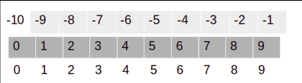
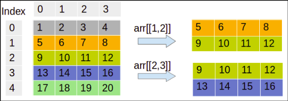

# NumPy 和 Pandas

## 理解 NumPy 数组

NumPy 数组是一系列同质项。同质意味着数组将具有相同数据类型的所有元素。可以使用带有项目列表的 `array()` 函数创建数组。用户还可以固定数组的数据类型。可能的数据类型包括bool、 int、 float、 long、 double 和 long double。

创建 NumPy 数组的另一种方法是使用 `arange()`。它创建一个均匀分布的 NumPy 数组。可以将三个值（start、 stop 和 step）传递给 `arange(start,[stop],step)` 函数。start 是范围的初始值，stop 是范围的最后一个值，step 是该范围内的增量。stop 参数是必需的。

除了 `array()` 和 `arange()` 函数之外，还有其他选项，例如 `zeros()`、`ones()`、`full()`、`eye()` 和 `random()`，它们也可用于创建 NumPy 数组，因为这些函数是初始占位符。

### 数组特征

一般来说，NumPy 数组是一种同质数据结构，具有相同类型的项。数组的主要优点是由于其项类型相同，因此存储大小确定。Python 列表使用循环来迭代元素并对其执行操作。NumPy 数组的另一个优点是提供矢量化操作，而不是迭代每个项并对其执行操作。NumPy 数组的索引与 Python 列表一样，从 0 开始。NumPy 使用优化的 C API 来快速处理数组操作。

使用 `type()` 时，它会返回 numpy.ndarray。这意味着 `type()` 函数返回容器的类型。使用 `dtype` 时，它会返回 int64，因为它是元素的类型。如果使用的是 32 位 Python，还可能会得到 int32 形式的输出。这两种情况都使用整数（32 位和 64 位）。一维 NumPy 数组也称为向量。

数组的 shape 属性是一个元组。

### 选择数组元素

选择数组元素非常简单。只需要将矩阵的索引指定为 `a[m,n]`。这里，m 是行索引，n 是矩阵的列索引。

## NumPy 数组数值数据类型

Python 提供三种类型的数值数据类型：整数类型、浮点类型和复数类型。

|Data Type|Details|
|---|---|
|`bool`|这是一个布尔类型，用于存储一个位并取 `True` 或 `False`|
|`inti`|平台整数可以是 int32 或 int64|
|`int8`|字节存储值范围从 ‑128 到 127|
|`int16`|它存储范围从‑32768 到 32767 的整数|
|`int32`|它存储范围从 $‑2^{31}$ 到 $2^{31} ‑1$ 的整数|
|`int64`|它存储范围从 $‑2^{63}$ 到 $2^{63} ‑1$ 的整数|
|`uint8`|它存储范围从 0到 255 的无符号整数|
|`uint16`|它存储范围从 0到 65535 的无符号整数|
|`uint32`|它存储范围从 0 到 $2^{32} – 1$ 的无符号整数|
|`uint64`|它存储从 0 到 $2^{64} – 1$ 范围内的无符号整数|
|`float16`|半精度浮点数；符号位为 5 位指数和 10 位尾数|
|`float32`|单精度浮点数；符号位为 8 位指数和 23 位尾数|
|`float64` or `float`|双精度浮点数；指数部分有 11 位，符号位有 52 位尾数|
|`complex64`|复数存储两个 32 位浮点数：实数和虚数数字|
|`complex128` or `complex`|复数存储两个 64 位浮点数：实数和虚数数字|

对于每种数据类型，都存在一个匹配的转换函数。许多函数都有一个数据类型参数，该参数通常是可选的。需要注意的是，不允许将复数转换为整数。

如果尝试将复杂数据类型转换为整数，则会出现 `TypeError`。如果尝试将复数转换为浮点数，将收到相同的错误。但是，可以通过设置单个部分将浮点值转换为复数。还可以使用 `real` 和 `imag` 属性提取这些部分。

### `dtype` 对象

`dtype` 告诉我们数组中各个元素的类型。NumPy 数组元素具有相同的数据类型，这意味着所有元素都具有相同的 d`type`。`dtype` 对象是 `numpy.dtype` 类的实例。

`dtype` 对象还使用 `itemsize` 属性告诉我们数据类型的大小（以字节为单位）

## 数据类型字符代码

包含字符代码是为了与 Numeric 向后兼容。Numeric 是 NumPy 的前身。不建议使用它，但这里提供代码是因为它会出现在各个位置，应该改用dtype对象。
|Type|Character Code|
|---|---|
|整数|i|
|无符号整数|u|
|单精度浮点数|f|
|双精度浮点数|d|
|布尔值|b|
|复数|D|
|字符串|S|
|Unicode|U|
|Void|V|

### `dtype` 构造函数

使用构造函数创建数据类型的方法有很多。构造函数用于实例化或为对象赋值。

- 要尝试通用的 Python 浮点数，使用以下命令：

```python
print(np.dtype(float))
```

- 要尝试使用字符代码的单精度浮点数，使用以下命令：

```python
print(np.dtype('f'))
```

- 要尝试使用字符代码的双精度浮点数，使用以下命令：

```python
print(np.dtype('d'))
```

- 要尝试使用双字符代码的dtype构造函数，使用以下命令：

```python
print(np.dtype('f8'))
```

这里，第一个字符代表类型，第二个字符是指定类型的字节数的数字，例如 2、4 或 8。

### `dtype` 属性

`dtype` 类提供了几个有用的属性。可以使用 `dtype` 属性获取有关数据类型的字符代码的信息。`type` 属性对应数组元素的对象类型。

## 操作数组形状

我们主要关注数组操作，例如 `reshape()`、`flatten()`、`ravel()`、`transpose()` 和 `resize()`：

- `reshape()` 将改变数组的形状：

```python
>>> arr = np.arange(12)
>>> new_arr = arr.reshape(4, 3)
>>> new_arr
array([[ 0,  1,  2],
       [ 3,  4,  5],
       [ 6,  7,  8],
       [ 9, 10, 11]])
>>>
```

- `flatten()` 将 n 维数组转换为一维数组：

```python
>>> arr = np.arange(1, 10).reshape(3, 3)
>>> arr
array([[1, 2, 3],
       [4, 5, 6],
       [7, 8, 9]])
>>> arr.flatten()
array([1, 2, 3, 4, 5, 6, 7, 8, 9])
>>>
```

- `ravel()` 函数与 `flatten()` 函数类似。它还将 n 维数组转换为一维数组。主要区别在于 `flatten()` 返回实际数组，而 `ravel()` 返回原始数组的引用。`ravel()` 函数比 `flatten()` 函数更快，因为它不占用额外内存：

```python
>>> arr.ravel()
array([1, 2, 3, 4, 5, 6, 7, 8, 9])
>>> 
```

- `transpose()` 函数是一个线性代数函数，它对给定的二维矩阵进行转置（可以调换任意轴）。转置一词的意思是将行转换为列，将列转换为行：

```python
>>> arr.transpose()
array([[1, 4, 7],
       [2, 5, 8],
       [3, 6, 9]])
>>>
```

- `resize()` 函数改变 NumPy 数组的大小。它与 `reshape()` 类似，但它会改变原始数组的形状：

```python
>>> arr.resize(1, 9)
>>> arr
array([[1, 2, 3, 4, 5, 6, 7, 8, 9]])
>>>
```

## NumPy 数组的堆叠

NumPy 提供了数组堆栈。堆叠意味着将相同维度的数组与新轴连接起来。堆叠可以水平、垂直、列、行或深度进行：

- 水平堆叠：在水平堆叠中，使用 `hstack()` 和 `concatenate()` 函数将相同维度的数组沿水平轴连接起来。

```python
>>> arr1 = np.arange(1, 10).reshape(3, 3)
>>> arr2 = 2 * arr1
>>>
>>> arr3 = np.hstack([arr1, arr2])
>>> arr3
array([[ 1,  2,  3,  2,  4,  6],
       [ 4,  5,  6,  8, 10, 12],
       [ 7,  8,  9, 14, 16, 18]])
>>>
>>> arr4 = np.concatenate([arr1, arr2], axis=1)
>>> arr4
array([[ 1,  2,  3,  2,  4,  6],
       [ 4,  5,  6,  8, 10, 12],
       [ 7,  8,  9, 14, 16, 18]])
>>>
```

- 垂直堆叠：在垂直堆叠中，使用 `vstack()` 和 `concatenate()` 函数将相同维数组沿垂直轴连接起来。

```python
>>> arr5 = np.vstack((arr1, arr2))
>>> arr5
array([[ 1,  2,  3],
       [ 4,  5,  6],
       [ 7,  8,  9],
       [ 2,  4,  6],
       [ 8, 10, 12],
       [14, 16, 18]])
>>> arr6 = np.concatenate((arr1, arr2), axis=0)
>>>
```

- 深度堆叠：在深度堆叠中，使用 `dstack()` 函数将相同维度的数组与第三轴（深度）连接起来。

```python
>>> arr7 = np.dstack((arr1, arr2))
>>> arr7
array([[[ 1,  2],
        [ 2,  4],
        [ 3,  6]],

       [[ 4,  8],
        [ 5, 10],
        [ 6, 12]],

       [[ 7, 14],
        [ 8, 16],
        [ 9, 18]]])
>>>
```

- 列堆叠：列堆叠将多个一维数组作为列堆叠成单个二维数组。

```python
>>> arr1 = np.arange(4, 7)
>>> arr2 = 2 * arr1
>>> np.column_stack((arr1, arr2))
array([[ 4,  8],
       [ 5, 10],
       [ 6, 12]])
>>>
```

- 行堆叠：行堆叠将多个一维数组作为行堆叠成单个二维数组。

```python
>>> np.row_stack((arr1, arr2))
array([[ 4,  5,  6],
       [ 8, 10, 12]])
>>>
```

## 对 NumPy 数组进行分区

NumPy 数组可以分割成多个子数组。NumPy 提供三种类型的分割功能：垂直、水平和深度。默认情况下，所有分割函数都会分割成相同大小的数组，但我们也可以指定分割位置。

- 水平分割：在水平分割中，使用 `hsplit()` 函数将给定的数组沿水平轴分成 N 个相等的子数组。

```python
>>> arr = np.arange(1, 10).reshape(3, 3)
>>> np.hsplit(arr, 3)
[array([[1],
       [4],
       [7]]), array([[2],
       [5],
       [8]]), array([[3],
       [6],
       [9]])]
>>> np.split(arr, 3, axis=1)
>>>
```

- 垂直分割：在垂直分割中，使用 `vsplit()` 和 `split()` 函数沿垂直轴将给定数组划分为 N 个相等的子数组。`axis=0` 的 `split` 函数执行与 `vsplit()` 函数相同的操作：

```python
>>> np.vsplit(arr, 3)
[array([[1, 2, 3]]), array([[4, 5, 6]]), array([[7, 8, 9]])]
>>> np.split(arr, 3, axis=0)
[array([[1, 2, 3]]), array([[4, 5, 6]]), array([[7, 8, 9]])]
>>>
```

## 更改 NumPy 数组的数据类型

NumPy 支持多种数据类型，例如 int、float 和 complex。`astype()` 函数转换数组的数据类型。

```python
>>> arr = np.arange(1, 10).reshape(3, 3)
>>> print("Integer Array:", arr)
Integer Array: [[1 2 3]
 [4 5 6]
 [7 8 9]]
>>>
>>> arr = arr.astype(float)
>>> print("Float Array:", arr)
Float Array: [[1. 2. 3.]
 [4. 5. 6.]
 [7. 8. 9.]]
>>>
>>> print("Changed Datatype:", arr.dtype)
Changed Datatype: float64
>>>
```

`tolist()` 函数将 NumPy 数组转换为 Python 列表。

```python
>>> arr = np.arange(1, 10)
>>> arr.tolist()
[1, 2, 3, 4, 5, 6, 7, 8, 9]
>>>
```

## 创建 NumPy 视图和副本

一些 Python 函数返回输入数组的副本或视图。Python 副本将数组存储在另一个位置，而视图使用相同的内存内容。这意味着副本是单独的对象，在 Python 中被视为**深层副本**。视图是原始基础数组，被视为**浅层副本**。以下是副本和视图的一些属性：

- 视图中的修改会影响原始数据，而副本中的修改不会影响原始数组。
- 视图使用共享内存的概念。
- 与视图相比，副本需要额外的空间。
- 复制比视图慢。

```python
>>> arr = np.arange(1, 5).reshape(2, 2)
>>> arr
array([[1, 2],
       [3, 4]])
>>>
>>> arr_no_copy = arr
>>> arr_copy = arr.copy()
>>> arr_view = arr.view()
>>>
>>> print("Original Array: ", id(arr))
Original Array:  2686795296144
>>> print("Assignment: ", id(arr_no_copy))
Assignment:  2686795296144
>>> print("Deep Copy: ", id(arr_copy))
Deep Copy:  2686795297008
>>> print("Shallow Copy(View): ", id(arr_view))
Shallow Copy(View):  2686795295952
>>>
```

在上面的示例中，可以看到原始数组和分配的数组具有相同的对象 ID，这意味着两者都指向同一个对象。副本和视图都具有不同的对象 ID；两者都将具有不同的对象，但视图对象将引用相同的原始数组，而副本将具有该对象的不同副本。

我们继续这个例子，更新原始数组的值并检查它对视图和副本的影响：

```python
>>> arr[1] = [99, 89]
>>> print("View array:\n", arr_view)
View array:
 [[ 1  2]
 [99 89]]
>>> print("Copied Array:\n", arr_copy)
Copied Array:
 [[1 2]
 [3 4]]
>>> arr_no_copy
array([[ 1,  2],
       [99, 89]])
>>>
```

我们可以从结果中得出结论，视图是原始数组。当我们更新原始数组时，值会发生变化，而副本是一个单独的对象，因为它的值保持不变。

## 切片 NumPy 数组

NumPy 中的切片类似于 Python 列表。索引倾向于选择单个值，而切片用于从数组中选择多个值。NumPy 数组还支持负索引和切片。这里，负号表示相反的方向，索引从右侧开始，起始值为 -1 。



在切片操作中，使用冒号符号来选择值的集合。切片采用三个值：start、stop 和 step：

```python
>>> arr = np.arange(0, 10)
>>> arr[3:6]
array([3, 4, 5])
>>> arr[3:]
array([3, 4, 5, 6, 7, 8, 9])
>>> arr[-3:]
array([7, 8, 9])
>>> arr[2:7:2]
array([2, 4, 6])
>>>
```

## 布尔和花式索引

索引技术帮助我们从 NumPy 数组中选择和过滤元素。布尔索引使用布尔表达式代替索引（在方括号中）来过滤 NumPy 数组。此索引返回布尔表达式为真值的元素。

```python
>>> arr = np.arange(21, 42, 2)
>>> print("Original Array:\n", arr)
Original Array:
 [21 23 25 27 29 31 33 35 37 39 41]
>>> print("After Boolean Condition:\n", arr[arr > 30])
After Boolean Condition:
 [31 33 35 37 39 41]
>>>
```

花式索引是一种特殊类型的索引，其中数组的元素由索引数组选择。这意味着我们将索引数组放在括号中传递。花式索引还支持多维数组。这将帮助我们轻松选择和修改复杂的多维数组集。

```python
>>> arr = np.arange(1, 21).reshape(5, 4)
>>> print("Original Array:\n", arr)
Original Array:
 [[ 1  2  3  4]
 [ 5  6  7  8]
 [ 9 10 11 12]
 [13 14 15 16]
 [17 18 19 20]]
>>>
>>> # Selecting 2nd and 3rd row
>>> indices = [1, 2]
>>> print("Selected 1st and 2nd Row:\n", arr[indices])
Selected 1st and 2nd Row:
 [[ 5  6  7  8]
 [ 9 10 11 12]]
>>> # Selecting 3nd and 4th row
>>> indices = [2, 3]
>>> print("Selected 3rd and 4th Row:\n", arr[indices])
Selected 3rd and 4th Row:
 [[ 9 10 11 12]
 [13 14 15 16]]
>>>
```



```python
>>> row = np.array([1, 3])
>>> col = np.array([0, 2])
>>> print("Selected Sub-Array:", arr[row, col])
Selected Sub-Array: [ 5 15]
>>>
```

## 广播数组

Python 列表不支持直接矢量化算术运算。与基于 Python 列表循环的运算相比，NumPy 提供了更快的矢量化数组运算。这里，所有循环运算都是用 C 而不是 Python 执行的，这使得它更快。广播功能检查在数组的不同形状上应用二元函数（例如加法、减法和乘法）的一组规则。

```python
>>> arr1 = np.arange(1, 5).reshape(2, 2)
>>>
>>> arr2 = np.arange(5, 9).reshape(2, 2)
>>> arr1 + arr2
array([[ 6,  8],
       [10, 12]])
>>> arr1 + 3
array([[4, 5],
       [6, 7]])
>>>
```

## 创建 pandas DataFrames

pandas 库旨在处理面板或表格数据。pandas 是一种快速、高效且高效的工具，用于处理和分析字符串、数字、日期时间和时间序列数据。pandas 提供 DataFrames 和 Series 等数据结构。pandas DataFrame 是一种表格、二维标记和索引数据结构，具有行和列网格。其列是异构类型。它能够处理不同类型的对象、执行分组和连接操作、处理缺失值、创建数据透视表以及处理日期。pandas DataFrame 可以通过多种方式创建。

我们创建了一个空的 DataFrame。

```python
# Create empty DataFrame
df = pd.DataFrame()
df.head()
```

我们使用了列表字典来创建 DataFrame。这里，字典的键相当于列，值表示为列表，相当于 DataFrame 的行。

```python
# Create dictionary of list
data = {
    "Name": ["Vijay", "Sundar", "Satyam", "Indira"],
    "Age": [23, 45, 46, 52],
}
df = pd.DataFrame(data)
df.head()
```

在下面的代码中，DataFrame 是使用字典列表创建的。在列表中，每个项目都是一个字典。每个键都是列的名称，值是行的单元格值。

```python
>>> data = [
...     {"Name": "Vijay", "Age": 23},
...     {"Name": "Sundar", "Age": 25},
...     {"Name": "Shankar", "Age": 26},
... ]
>>> # Creates DataFrame.
>>> df = pd.DataFrame(data, columns=["Name", "Age"])
>>> # Print dataframe header
>>> df.head()
      Name  Age
0    Vijay   23
1   Sundar   25
2  Shankar   26
>>>
```

让我们使用元组列表创建一个 DataFrame：

```python
>>> # Creating DataFrame using list of tuples.
>>> data = [("Vijay", 23), ("Sundar", 45), ("Satyam", 46), ("Indira", 52)]
>>> # Create dataframe
>>> df = pd.DataFrame(data, columns=["Name", "Age"])
>>> # Print dataframe header
>>> df.head()
     Name  Age
0   Vijay   23
1  Sundar   45
2  Satyam   46
3  Indira   52
>>>
```

## 理解 pandas Series

pandas Series 是一种一维顺序数据结构，能够处理任何类型的数据，例如字符串、数字、日期时间、Python 列表以及带有标签和索引的字典。Series 是 DataFrame 的列之一。我们可以使用 Python 字典、NumPy 数组和标量值创建 Series。

- 使用 Python 字典：创建一个字典对象并将其传递给 Series 对象：

```python
>>> # Creating Pandas Series using Dictionary
>>> dict1 = {0: "Ajay", 1: "Jay", 2: "Vijay"}
>>> series = pd.Series(dict1)
>>> series
0     Ajay
1      Jay
2    Vijay
dtype: object
>>>
```

- 使用 NumPy 数组：创建一个 NumPy 数组对象并将其传递给 Series 对象：

```python
>>> # Create Pandas Series
>>> series = pd.Series(arr)
>>> series
0    51
1    65
2    48
3    59
4    68
dtype: int32
>>>
```

- 使用单个标量值：要创建具有标量值的 pandas Series，传递标量值和索引列表到 Series 对象：

```python
>>> series = pd.Series(10, index=[0, 1, 2, 3, 4, 5])
>>> series
0    10
1    10
2    10
3    10
4    10
5    10
dtype: int64
>>>
```

- 我们还可以通过选择 DataFrame 一个列（例如国家/地区）来创建一个 Series：

```python
>>> df = pd.read_csv("dataset/WHO_first9cols.csv")
>>> df.head()
       Country  CountryID  Continent  ...  Net primary school enrolment ratio female (%)  Net primary school enrolment ratio male (%)  Population (in thousands) total
0  Afghanistan          1          1  ...                                            NaN                                          NaN                          26088.0
1      Albania          2          2  ...                                           93.0                                         94.0                           3172.0
2      Algeria          3          3  ...                                           94.0                                         96.0                          33351.0
3      Andorra          4          2  ...                                           83.0                                         83.0                             74.0
4       Angola          5          3  ...                                           49.0                                         51.0                          16557.0

[5 rows x 9 columns]
>>> country_series = df["Country"]
>>> type(country_series)
<class 'pandas.core.series.Series'>
>>>
```

pandas Series 数据结构与 DataFrames 共享一些常见属性，并且还具有 name 属性。

```python
>>> print("Shape:", df.shape)
Shape: (202, 9)
>>> print("List of Columns:", df.columns)
List of Columns: Index(['Country', 'CountryID', 'Continent', 'Adolescent fertility rate (%)',
       'Adult literacy rate (%)',
       'Gross national income per capita (PPP international $)',
       'Net primary school enrolment ratio female (%)',
       'Net primary school enrolment ratio male (%)',
       'Population (in thousands) total'],
      dtype='object')
>>> print("Data types:", df.dtypes)
Data types: Country                                                    object
CountryID                                                   int64
Continent                                                   int64
Adolescent fertility rate (%)                             float64
Adult literacy rate (%)                                   float64
Gross national income per capita (PPP international $)    float64
Net primary school enrolment ratio female (%)             float64
Net primary school enrolment ratio male (%)               float64
Population (in thousands) total                           float64
dtype: object
>>>
```

## 读取和查询 Quandl 数据

Quandl 是一家总部位于加拿大的公司，为投资数据分析师提供商业和另类金融数据。Quandl 了解投资和金融量化分析师的需求。它使用 API、R、Python 或 Excel 提供数据。
> 使用 API 是免费的，但每天最多只能调用 50 次 API。如果您需要更多 API 调用，则必须请求身份验证密钥。

```python
>>> import quandl
>>>
>>> sunspots = quandl.get("SIDC/SUNSPOTS_A")
>>> sunspots.head()
            Yearly Mean Total Sunspot Number  Yearly Mean Standard Deviation  Number of Observations  Definitive/Provisional Indicator
Date
1700-12-31                               8.3                             NaN                     NaN                               1.0
1701-12-31                              18.3                             NaN                     NaN                               1.0
1702-12-31                              26.7                             NaN                     NaN                               1.0
1703-12-31                              38.3                             NaN                     NaN                               1.0
1704-12-31                              60.0                             NaN                     NaN                               1.0
>>> sunspots.tail()
            Yearly Mean Total Sunspot Number  Yearly Mean Standard Deviation  Number of Observations  Definitive/Provisional Indicator
Date
2016-12-31                              39.8                             3.9                  9940.0                               1.0
2017-12-31                              21.7                             2.5                 11444.0                               1.0
2018-12-31                               7.0                             1.1                 12611.0                               1.0
2019-12-31                               3.6                             0.5                 12884.0                               1.0
2020-12-31                               8.8                             4.1                 14440.0                               1.0
>>> sunspots_filtered = sunspots[
...     ["Yearly Mean Total Sunspot Number", "Definitive/Provisional Indicator"]
... ]
>>> sunspots_filtered["2002-01-01":"2013-12-31"]
            Yearly Mean Total Sunspot Number  Definitive/Provisional Indicator
Date
2002-12-31                             163.6                               1.0
2003-12-31                              99.3                               1.0
2004-12-31                              65.3                               1.0
2005-12-31                              45.8                               1.0
2006-12-31                              24.7                               1.0
2007-12-31                              12.6                               1.0
2008-12-31                               4.2                               1.0
2009-12-31                               4.8                               1.0
2010-12-31                              24.9                               1.0
2011-12-31                              80.8                               1.0
2012-12-31                              84.5                               1.0
2013-12-31                              94.0                               1.0
>>>
```

布尔过滤：我们可以使用类似于 SQL 的 `WHERE` 子句条件的布尔条件查询数据。

```python
>>> # Boolean Filter
>>> sunspots[
...     sunspots["Yearly Mean Total Sunspot Number"]
...     > sunspots["Yearly Mean Total Sunspot Number"].mean()
... ]
            Yearly Mean Total Sunspot Number  Yearly Mean Standard Deviation  Number of Observations  Definitive/Provisional Indicator
Date
1705-12-31                              96.7                             NaN                     NaN                               1.0
1717-12-31                             105.0                             NaN                     NaN                               1.0
1718-12-31                             100.0                             NaN                     NaN                               1.0
1726-12-31                             130.0                             NaN                     NaN                               1.0
1727-12-31                             203.3                             NaN                     NaN                               1.0
...                                      ...                             ...                     ...                               ...
2003-12-31                              99.3                             7.1                  7087.0                               1.0
2011-12-31                              80.8                             6.7                  6077.0                               1.0
2012-12-31                              84.5                             6.7                  5753.0                               1.0
2013-12-31                              94.0                             6.9                  5347.0                               1.0
2014-12-31                             113.3                             8.0                  5273.0                               1.0

[136 rows x 4 columns]
>>>
```

## 描述 pandas DataFrames

pandas DataFrame 有十几种统计方法。下表列出了这些方法以及每种方法的简短说明：
|Method|Description|
|---|---|
|`describes`|此方法返回一个带有描述性统计数据的表。|
|`count`|此方法返回非 NaN 项的数量。|
|`mad`|该方法计算平均绝对偏差，这是一个与标准偏差类似的稳健测量。|
|`median`|此方法返回中位数。这相当于第 50 个百分位数的值。|
|`min`|此方法返回最小值。|
|`max`|此方法返回最大值。|
|`mode`|此方法返回众数，即出现次数最多的值。|
|`std`|此方法返回标准偏差，用于测量离散度。它是方差的平方根。|
|`var`|此方法返回方差。|
|`skew`|此方法返回偏度。偏度表示分布对称。|
|`kurt`|此方法返回峰度。峰度表示分布的形状。|

```python
>>> df.describe()
        CountryID   Continent  ...  Net primary school enrolment ratio male (%)  Population (in thousands) total
count  202.000000  202.000000  ...                                   179.000000                     1.890000e+02
mean   101.500000    3.579208  ...                                    85.698324                     3.409964e+04
std     58.456537    1.808263  ...                                    15.451212                     1.318377e+05
min      1.000000    1.000000  ...                                    11.000000                     2.000000e+00
25%     51.250000    2.000000  ...                                    79.500000                     1.328000e+03
50%    101.500000    3.000000  ...                                    90.000000                     6.640000e+03
75%    151.750000    5.000000  ...                                    96.000000                     2.097100e+04
max    202.000000    7.000000  ...                                   100.000000                     1.328474e+06

[8 rows x 8 columns]
>>>
```

## 分组和连接 pandas DataFrame

分组是一种数据聚合操作。分组术语取自关系数据库。关系数据库软件使用 `group by` 关键字将列中类似的值分组。我们可以对组应用聚合函数，例如平均值、最小值、最大值、计数和总和。pandas DataFrame 也提供类似的功能。分组操作基于拆分‑应用‑合并策略。它首先将数据分成几组，然后对每组应用聚合操作，例如平均值、最小值、最大值、计数和总和，并合并每组的结果。

```python
>>> df.groupby("Continent").mean(numeric_only=True)
            CountryID  Adolescent fertility rate (%)  ...  Net primary school enrolment ratio male (%)  Population (in thousands) total
Continent                                             ...
1          110.238095                      37.300000  ...                                    88.315789                     16843.350000
2          100.333333                      20.500000  ...                                    93.088889                     17259.627451
3           99.354167                     111.644444  ...                                    72.021277                     16503.195652
4           56.285714                      49.600000  ...                                    94.400000                     73577.333333
5           94.774194                      77.888889  ...                                    88.517241                     15637.241379
6          121.228571                      39.260870  ...                                    89.960000                     25517.142857
7           80.777778                      57.333333  ...                                    88.888889                    317683.666667

[7 rows x 7 columns]
>>> 
```

```python
>>> df.groupby("Continent").mean(numeric_only=True)["Adult literacy rate (%)"]
Continent
1    76.900000
2    97.911538
3    61.690476
4    91.600000
5    87.940909
6    87.607143
7    69.812500
Name: Adult literacy rate (%), dtype: float64
>>>
```

还可以通过将列列表传递给 `groupby()` 函数来基于多列进行分组。

连接是表格数据库的一种合并操作。连接概念源自关系数据库。在关系数据库中，表被规范化或分解以减少冗余和不一致，连接用于从多个表中选择信息。数据分析师需要组合来自多个来源的数据。pandas 还提供连接功能，使用 `merge()` 函数连接多个 DataFrame。

- 内连接：内连接相当于集合的交集操作。它将仅选择两个 DataFrames 中的公共记录。要执行内连接，使用带有 DataFrames 和参数上的相同属性的 `merge()` 函数以及内连接值来显示参数。`on` 参数用于根据将要执行的连接提供相同属性以及 `how` 定义连接的类型：

```python
>>> df_inner = pd.merge(dest, tips, on="EmpNr", how="inner")
>>> df_inner
   EmpNr       Dest  Amount
0      5  The Hague    10.0
1      9  Rotterdam     5.0
>>>
```

- 完全外连接：外连接相当于集合的并集操作。它合并左右 DataFrames。它将包含两个 DataFrames 中的所有记录，并在找不到匹配项的地方填充 NaN：

```python
>>> df_outer = pd.merge(dest, tips, on="EmpNr", how="outer")
>>> df_outer
   EmpNr       Dest  Amount
0      5  The Hague    10.0
1      3  Amsterdam     NaN
2      9  Rotterdam     5.0
3      7        NaN     2.5
>>> 
```

- 右外连接：在右外连接中，将选择 DataFrame 右侧的所有记录。如果在左侧 DataFrame 中找不到匹配的记录，则用 NaN 填充：

```python
>>> df_right = pd.merge(dest, tips, on="EmpNr", how="right")
>>> df_right
   EmpNr       Dest  Amount
0      5  The Hague    10.0
1      9  Rotterdam     5.0
2      7        NaN     2.5
>>>
```

- 左外连接：在左外连接中，将选择 DataFrame 左侧的所有记录。如果在右侧 DataFrame
中找不到匹配的记录，则用 NaN 填充：

```python
>>> df_left = pd.merge(dest, tips, on="EmpNr", how="left")
>>> df_left
   EmpNr       Dest  Amount
0      5  The Hague    10.0
1      3  Amsterdam     NaN
2      9  Rotterdam     5.0
>>>
```

## 处理缺失值

大多数现实世界的数据集都是混乱和嘈杂的。由于它们的混乱和噪声，许多值要么有错误，要么缺失。pandas 提供了许多内置函数来处理 DataFrames 中的缺失值：

- 检查 DataFrame 中的缺失值： pandas 的 `isnull()` 函数检查是否存在空值并返回 `True` 或 `False`，其中 `True` 表示空值，`False` 表示非空值。

```python
>>> df.isnull().sum()
Country                                                    0
CountryID                                                  0
Continent                                                  0
Adolescent fertility rate (%)                             25
Adult literacy rate (%)                                   71
Gross national income per capita (PPP international $)    24
Net primary school enrolment ratio female (%)             23
Net primary school enrolment ratio male (%)               23
Population (in thousands) total                           13
dtype: int64
>>> # pd.isnull(df).sum()
>>>
```

- 删除缺失值：处理缺失值的一个非常简单的方法就是为了分析目的而删除它们。pandas 有 `dropna()` 函数可以从 DataFrame 中删除此类观察值。

```python
>>> df.dropna(inplace=True)
>>> df.info()
<class 'pandas.core.frame.DataFrame'>
Int64Index: 118 entries, 1 to 200
Data columns (total 9 columns):
 #   Column                                                  Non-Null Count  Dtype
---  ------                                                  --------------  -----
 0   Country                                                 118 non-null    object
 1   CountryID                                               118 non-null    int64
 2   Continent                                               118 non-null    int64
 3   Adolescent fertility rate (%)                           118 non-null    float64
 4   Adult literacy rate (%)                                 118 non-null    float64
 5   Gross national income per capita (PPP international $)  118 non-null    float64
 6   Net primary school enrolment ratio female (%)           118 non-null    float64
 7   Net primary school enrolment ratio male (%)             118 non-null    float64
 8   Population (in thousands) total                         118 non-null    float64
dtypes: float64(6), int64(2), object(1)
memory usage: 9.2+ KB
>>>
```

- 填充缺失值：另一种方法是用零、平均值、中位数或常数值填充缺失值：

```python
df.fillna(0, inplace=True)
```

## 创建数据透视表

数据透视表是汇总表。它是 Excel 中最流行的概念。大多数数据分析师都将其用作汇总结果的便捷工具。pandas 提供了 `pivot_table()` 函数来汇总DataFrames。

```python
>>> purchase = pd.read_csv("dataset/purchase.csv")
>>> purchase.head()
  Weather       Food     Price  Number
0    cold       soup  3.745401       8
1     hot       soup  9.507143       8
2    cold   icecream  7.319939       8
3     hot  chocolate  5.986585       8
4    cold   icecream  1.560186       8
>>> pd.pivot_table(
...     purchase,
...     values="Number",
...     index=["Weather"],
...     columns=["Food"],
...     aggfunc=np.sum,
... )
Food     chocolate  icecream  soup
Weather
cold           NaN      16.0  16.0
hot            8.0       8.0   8.0
>>>
```

## 处理日期

处理日期既麻烦又复杂。pandas提供日期范围、重新采样时间序列数据并执行日期算术运算。

```python
>>> pd.date_range("2000-01-01", periods=45, freq="D")
DatetimeIndex(['2000-01-01', '2000-01-02', '2000-01-03', '2000-01-04',
               '2000-01-05', '2000-01-06', '2000-01-07', '2000-01-08',
               '2000-01-09', '2000-01-10', '2000-01-11', '2000-01-12',
               '2000-01-13', '2000-01-14', '2000-01-15', '2000-01-16',
               '2000-01-17', '2000-01-18', '2000-01-19', '2000-01-20',
               '2000-01-21', '2000-01-22', '2000-01-23', '2000-01-24',
               '2000-01-25', '2000-01-26', '2000-01-27', '2000-01-28',
               '2000-01-29', '2000-01-30', '2000-01-31', '2000-02-01',
               '2000-02-02', '2000-02-03', '2000-02-04', '2000-02-05',
               '2000-02-06', '2000-02-07', '2000-02-08', '2000-02-09',
               '2000-02-10', '2000-02-11', '2000-02-12', '2000-02-13',
               '2000-02-14'],
              dtype='datetime64[ns]', freq='D')
>>>
```

`date_range()` 频率参数可以取值如下：B 表示工作日频率，W 表示每周频率，H 表示每小时频率，M 表示分钟频率，S 表示秒频率，L 表示毫秒频率，U 表示微秒频率。

`to_datetime()` 将时间戳字符串转换为日期时间：

```python
>>> pd.to_datetime("1970-01-01")
Timestamp('1970-01-01 00:00:00')
>>> 
```

我们可以将指定格式的时间字符串对象转换为日期时间对象：

```python
>>> pd.to_datetime(["20000101", "20000201"], format="%Y%m%d")
DatetimeIndex(['2000-01-01', '2000-02-01'], dtype='datetime64[ns]', freq=None)
>>>
```

未知的输入格式可能导致值错误。我们可以通过使用 coerce 的错误参数来处理这个问题。 coerce 会将无效字符串设置为 `NaT`：

```python
>>> pd.to_datetime(["20200101", "Not a date"])
TypeError: invalid string coercion to datetime for "Not a date" at position 1
>>> pd.to_datetime(["20200101", "Not a date"], errors="coerce")
DatetimeIndex(['2020-01-01', 'NaT'], dtype='datetime64[ns]', freq=None)
>>>
```

第二个日期仍然无效，无法转换为 datetime 对象。errors 参数通过输入值 NaT（不是时间）帮助我们处理此类错误。
