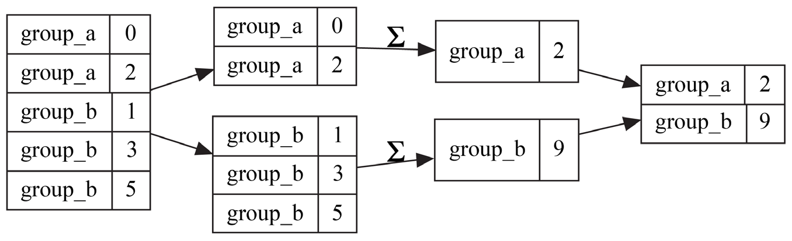
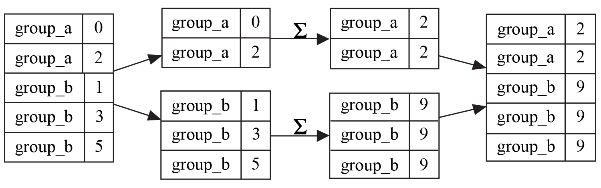

# 分组

数据分析过程中最基本的任务之一是将数据拆分成独立的组，然后对每个组进行计算。这种方法已经存在了很长一段时间，但最近被称为拆分‑应用‑合并。

在拆分‑应用‑合并范式的应用步骤中，了解我们是在尝试执行归约（也称为聚合）还是转换也很有帮助。前者将组中的值缩减为一个值，而后者则尝试保持组的形状。

以下是相同的转换范例：

在 pandas 中，`pd.DataFrame.groupby` 方法负责拆分、应用您选择的函数并将结果重新组合在一起以供最终用户使用。
