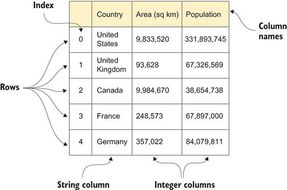
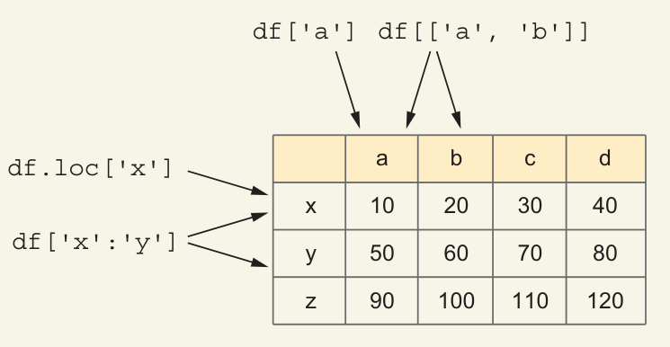

# Data frames

由于数据框中的每一列都是一个独立的系列，因此每列可以具有不同的 `dtype`。例如，我们可以有一个数据框，其中包含一个整数列、一个浮点列和一个字符串列。

## 括号还是点？

当我们处理 `Series` 时，我们可以通过几种方式检索值：使用索引（`loc`）、使用位置（`iloc`）以及使用方括号，在简单情况下，方括号相当于 `loc`。但是，当我们处理 `DataFrames` 时，我们必须使用 `loc` 或 `iloc` 来检索行。这是因为方括号指的是列。

但是“方括号表示列”规则有一个例外：如果我们使用切片，pandas 将查看数据框的行，而不是其列。这意味着我们可以使用 `df[x:y]` 检索从 `x` 到 `y` 的行。切片告诉 pandas 使用行而不是列。此外，切片将返回包含端点的行，这对于 Python 来说是不常见的（但在 pandas 中使用 `loc` 时很常见）。

处理列的另一种方法是使用点符号。
