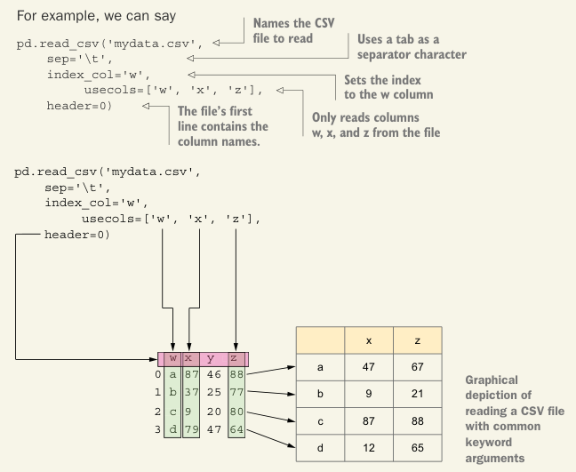

# Importing and exporting data

当我们从 CSV 文件读取数据（使用 `pd.read_csv`）或写入数据时转换为 CSV（使用 `df.to_csv`），我们可以从许多参数中进行选择，每个参数都会影响 CSV 的呈现形式：

- `sep`: 字段分隔符，默认情况下（可能很明显）是逗号但通常可以是制表符(`\t`)
- `header`: 是否有描述列名的标题，以及它们出现在文件的哪个行中
- `index_col`: 如果有的话，哪一列应该设置为我们数据框的索引
- `usecols`: 文件中的哪些列应该包含在数据框中

